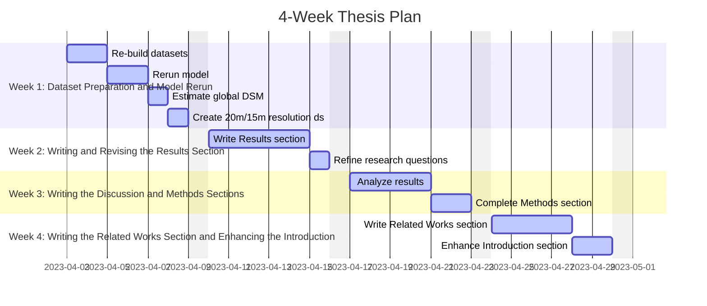

# Thesis-progress-tracking
A 4-week plan

Week 1: Dataset Preparation and Model Rerun
- [x] Re-build the datasets, ensuring the test DSMs are unseen by the model.
- [ ] Rerun the model with the updated datasets and analyze the test batch results.
- [ ] Use the model to estimate global DSM and record the findings.
- [ ] Create a dataset with 20m/15m resolution and compare the results with the 30m resolution dataset.

Week 2: Writing and Revising the Results Section
- [ ] Write the Results section, including comparisons of different resolution datasets and global DSM estimations.
- [ ] Refine the research questions to align better with the updated methodology and results.

Week 3: Writing the Discussion and Methods Sections
- [ ] Discuss and analyze the results obtained in Week 2.
- [ ] Complete the Methods section, providing a comprehensive description of the methodology.

Week 4: Writing the Related Works Section and Enhancing the Introduction
- [ ] Write the Related Works section using the earlier-created outline, incorporating recent research findings and relevant literature.
- [ ] Enhance the Introduction section, adding more context, background, and motivation for a more engaging and informative presentation.

